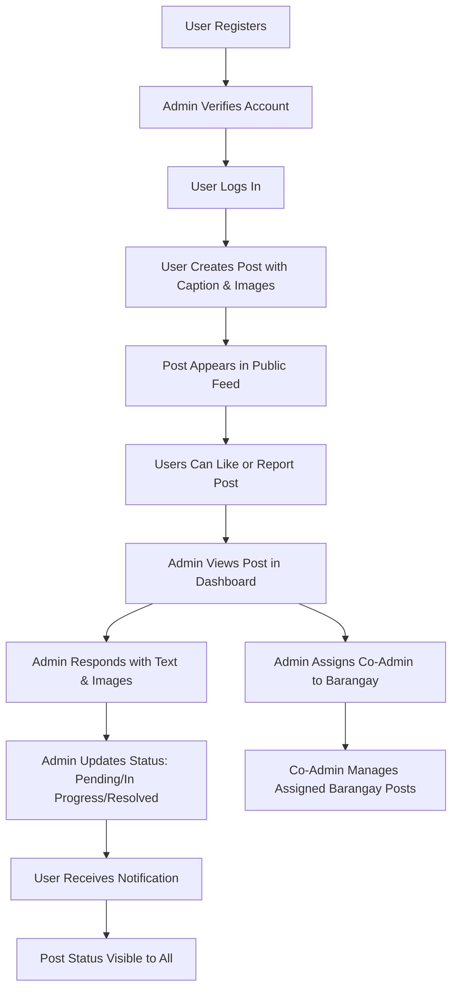

# Bantayan Community Action Portal - Detailed Plan

## System Overview

A web-based platform for residents of Bantayan Island proper to submit public posts about community issues, with government administrators responding, verifying users, managing roles, and tracking resolution status.

## Key Features

- User registration with name, email, phone, address (Municipality: Bantayan, Province: Cebu, Barangay: 25 options)
- Public posting with captions and images
- Admin responses with text and images (e.g., before/after photos)
- User verification by admins
- Role management: main admins assign co-admins to barangays
- Post status tracking: pending, in progress, resolved
- Like and report features for posts
- Admin dashboard with filtering by barangay

## Technology Stack

- MERN: MongoDB, Express.js, React, Node.js
- File uploads for images
- JWT for authentication

## Workflow Diagram

## Suggestions for Improvement

1. Add post categories (e.g., Infrastructure, Health, Environment, Education) for better organization
2. Implement search and advanced filtering (by date, status, barangay, keywords)
3. Add user profiles showing post history and contribution
4. Integrate push notifications for real-time updates
5. Create analytics dashboard for admins with charts on post volume, resolution times, popular issues
6. Allow anonymous posting with optional verification (though accountability is important)
7. Develop a mobile app version for better accessibility
8. Add moderation tools for admins to hide or delete inappropriate posts
9. Implement voting/polling features for community decision-making
10. Integrate with local government systems for data sharing and official records
11. Add multi-language support (Cebuano, English)
12. Implement automated email notifications for status changes
13. Add geolocation tagging for posts
14. Create a knowledge base of common issues and solutions
15. Add reporting features for admins to generate monthly reports

## Next Steps

The current todo list covers the core implementation. Review and approve the plan before proceeding to code mode for development.
